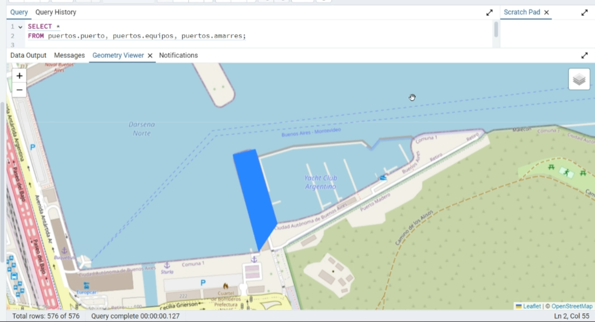
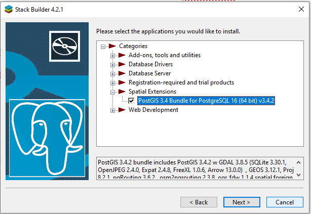
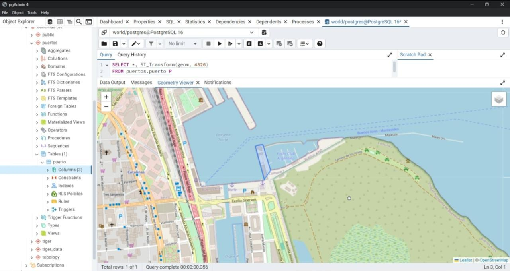
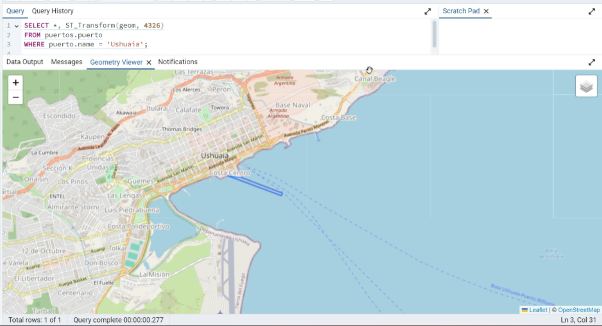
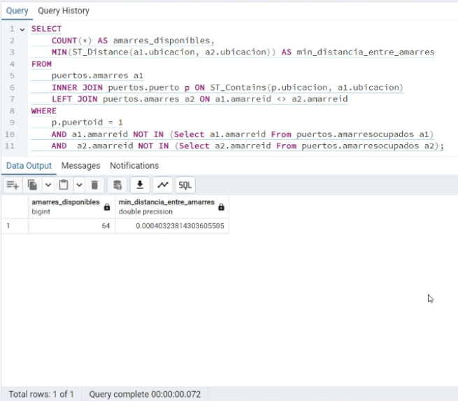
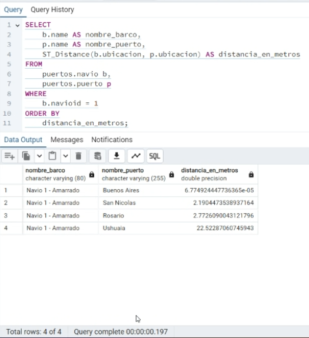
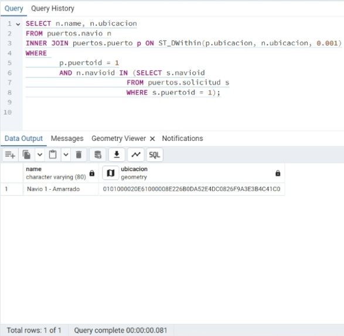

# Gestión de Puertos con PostGIS

Base de datos relacional **geoespacial** para la gestión de puertos y servicios portuarios:
cuatro puertos argentinos georreferenciados con sus muelles, amarres y equipos, y los navíos
que solicitan servicio antes de arribar y una vez amarrados.

Trabajo Práctico N°2 de **Base de Datos II** — Ingeniería en Informática, Universidad Católica
de Santiago del Estero, Departamento Académico Rafaela. Junio de 2024.



> El polígono azul es el puerto de Buenos Aires almacenado como `geometry(Polygon, 4326)`,
> proyectado con `ST_Transform` y renderizado sobre OpenStreetMap desde el Geometry Viewer de
> pgAdmin.

---

## Índice

- [El caso de estudio](#el-caso-de-estudio)
- [Stack](#stack)
- [Modelo de datos](#modelo-de-datos)
- [Las consultas espaciales](#las-consultas-espaciales)
- [Cómo levantarlo](#cómo-levantarlo)
- [Sobre la reconstrucción del esquema](#sobre-la-reconstrucción-del-esquema)
- [Qué haría distinto hoy](#qué-haría-distinto-hoy)
- [Contenido del repositorio](#contenido-del-repositorio)
- [Créditos](#créditos)

---

## El caso de estudio

La consigna pedía llevar un sistema de gestión portuaria, modelado en un TP anterior como base
relacional clásica, al terreno geoespacial. Los once puntos del enunciado cubrían desde la
instalación de PostGIS hasta una evaluación crítica de la tecnología:

| # | Punto | Dónde está resuelto |
|---|---|---|
| I–II | Instalación de PostGIS y documentación del proceso | [informe](docs/informe-tp2-postgis.pdf), capturas 01–04 |
| III | Tipos de datos espaciales y diferencias con una BD tradicional | informe |
| IV | Estructura de BD: ubicar puertos, equipos, amarres y navíos | [`sql/01_schema.sql`](sql/01_schema.sql), [`sql/02_seed.sql`](sql/02_seed.sql) |
| V | Generar un mapa con los datos geográficos | `ST_Transform` + Geometry Viewer |
| VI | Tres consultas espaciales sobre el caso | [`sql/03_consultas.sql`](sql/03_consultas.sql) |
| VII | Concurrencia: bloqueos, aislamiento, trabajo distribuido | informe |
| VIII–XI | Casos de éxito, ventajas, desventajas, recomendación como DBA | informe |

Sobre el punto VII, la respuesta entregada analizaba bloqueos compartidos y exclusivos, el uso
de `REPEATABLE READ` para lecturas y `SERIALIZABLE` para el resto, y las tres vías de
PostgreSQL para operar distribuido: replicación síncrona/asíncrona, sharding vía Citus y
*foreign data wrappers*. La propuesta concreta era una base por puerto con el nodo de Buenos
Aires como centralizador de réplicas.

## Stack

| Componente | Versión |
|---|---|
| PostgreSQL | 16.3 |
| PostGIS | 3.4.2 (bundle con GDAL 3.8.5, GEOS 3.12.1, PROJ 9.4) |
| Sistema de referencia | EPSG:4326 (WGS 84) |
| Índices espaciales | GiST sobre cada columna geométrica |
| Cliente | pgAdmin 4 (Geometry Viewer sobre Leaflet + OpenStreetMap) |



## Modelo de datos

Siete tablas en el schema `puertos`. Cuatro de ellas llevan geometría:

| Tabla | Geometría | Rol |
|---|---|---|
| `puerto` | `Polygon` | superficie operativa del puerto |
| `muelle` | — | estructura de atraque, con su calado |
| `amarres` | `Point` | posición donde se amarra un navío |
| `navio` | `Point` | posición actual del buque, en navegación o amarrado |
| `equipos` | `Point` | maquinaria del puerto |
| `solicitud` | — | pedido de servicio de un navío a un puerto |
| `amarresocupados` | — | qué amarre está tomado, por quién y desde cuándo |

La decisión de modelado que sostiene todo el trabajo es que **el puerto es un polígono y no un
punto**. Eso es lo que permite preguntar qué amarres pertenecen a un puerto por contención
geométrica (`ST_Contains`) en lugar de por una clave foránea, y lo que hace que la distancia de
un navío al puerto sea la distancia a su borde y no a un centroide arbitrario.

Los datos cubren cuatro puertos — Buenos Aires, Ushuaia, Rosario y San Nicolás — con 18
amarres, 8 equipos y 3 navíos.





## Las consultas espaciales

Las tres del ejercicio VI, en [`sql/03_consultas.sql`](sql/03_consultas.sql) tal como se
entregaron en 2024.

### (a) Amarres disponibles y mínima distancia entre ellos

Combina contención (`ST_Contains`) para saber qué amarres son del puerto, con `ST_Distance`
para medir la separación entre los que están libres.



La mínima distancia publicada, `0.00040323814303605505`, corresponde a los amarres 3 y 4 de
Buenos Aires: unos 45 metros.

### (b) Distancia de un navío al puerto donde solicitó servicio



El navío 1 aparece a `6.77e-05` de Buenos Aires y a `22.52` de Ushuaia. El orden es correcto,
pero las unidades no son las que dice el alias de la columna — ver
[Qué haría distinto hoy](#qué-haría-distinto-hoy).

### (c) Navíos dentro de un perímetro

`ST_DWithin` cruzado con la tabla de solicitudes: de los tres navíos que pidieron servicio en
Buenos Aires, sólo uno cae dentro del radio de control.



El WKB devuelto decodifica a `POINT(-58.364412 -34.595558)` en SRID 4326, exactamente la
posición del navío 1.

## Cómo levantarlo

```bash
docker compose up -d
```

Eso arranca PostgreSQL 16 con PostGIS 3.4 en el puerto `5433` y ejecuta el esquema y los datos
automáticamente. Después:

```bash
docker compose exec -T db psql -U postgres -d puertos -f /sql/04_verificacion.sql
```

`04_verificacion.sql` contrasta lo que produce esta base contra los valores publicados en el
informe de 2024 y devuelve OK o FALLA por cada control.

Para explorar las consultas del ejercicio VI:

```bash
docker compose exec -T db psql -U postgres -d puertos -f /sql/03_consultas.sql
```

## Sobre la reconstrucción del esquema

Vale la pena ser explícito acá, porque hace a la honestidad del repo.

**El backup entregado en 2024 no contiene el schema `puertos`.** Está en
[`data/DBworld-bp1.backup`](data/) y se puede inspeccionar:

```bash
pg_restore -l data/DBworld-bp1.backup
```

Sólo aparecen la capa `world_countries_generalized` y las tablas de soporte de PostGIS, Tiger
y pointcloud. El schema `puertos` vivía dentro de esa misma base `world` — se lo ve en el árbol
de objetos de pgAdmin, en la captura de arriba — pero quedó fuera del archivo entregado.

Por eso `01_schema.sql` y `02_seed.sql` son una **reconstrucción**. No una aproximación
plausible: una restitución verificable. Las fuentes fueron las definiciones de tablas y las
coordenadas de [`docs/notas-del-equipo.txt`](docs/notas-del-equipo.txt), las consultas y tipos
de columna del informe, y el árbol de objetos de las capturas.

Que sea fiel no hay que creerlo, se comprueba. Al recalcular por fuera de PostGIS las
distancias que el informe publicó, a partir de las coordenadas de las notas:

| Resultado del informe (2024) | Valor publicado | Recalculado |
|---|---|---|
| Distancia navío 1 → Buenos Aires | `6.774924447736365e-05` | idéntico, 16 dígitos significativos |
| Mínima distancia entre amarres libres | `0.00040323814303605505` | idéntico |
| Distancia navío 1 → San Nicolás | `2.1904473538937164` | idéntico |
| Distancia navío 1 → Ushuaia | `22.52287060745943` | idéntico |
| Distancia navío 1 → Rosario | `2.7726090043121796` | `2.772609004312179` (1 ULP) |

Coincidencias de dieciséis dígitos significativos no ocurren por casualidad: las coordenadas
del repo son las que produjeron aquellas salidas.

El único valor que **no** se reproduce es el `COUNT(*) = 64` de la consulta (a), y no se
reproduce porque está mal. Ver el punto siguiente.

## Qué haría distinto hoy

El trabajo se entregó y funcionó. Releerlo tres años después, con el esquema ya ejecutable,
deja ver cuatro cosas.

### 1. Las distancias no están en metros

La consulta (b) llama `distancia_en_metros` a su columna, pero `ST_Distance` sobre geometrías
en SRID 4326 opera sobre grados, tratando latitud y longitud como si fueran coordenadas
cartesianas. Los `22.52` de Ushuaia son 22,5 **grados**: la distancia real ronda los 2.375 km.
Los `6.77e-05` de Buenos Aires son unos 7,5 metros.

El orden del resultado salió bien por casualidad — a esas latitudes la deformación es
monótona — pero cualquier comparación contra un umbral en metros habría fallado.

```sql
-- Corregido: geography opera sobre el elipsoide y devuelve metros
SELECT
    b.name AS nombre_barco,
    p.name AS nombre_puerto,
    ST_Distance(b.ubicacion::geography, p.ubicacion::geography) AS distancia_en_metros
FROM puertos.navio b
CROSS JOIN puertos.puerto p
WHERE b.navioid = 1
ORDER BY distancia_en_metros;
```

Para trabajo intensivo sobre territorio argentino, la alternativa es reproyectar a POSGAR 2007
(EPSG:5343–5349), que da metros planos y es más barato de calcular que `geography`.

El mismo problema afecta al radio de la consulta (c): `ST_DWithin(..., 0.001)` no es un círculo
de 111 metros sino una elipse de unos 111 m norte-sur por 92 m este-oeste, porque un grado de
longitud se acorta con el coseno de la latitud. El umbral quedó definido por accidente y no por
criterio.

### 2. La consulta (a) cuenta pares, no amarres

```sql
FROM puertos.amarres a1
    INNER JOIN puertos.puerto p ON ST_Contains(p.ubicacion, a1.ubicacion)
    LEFT JOIN puertos.amarres a2 ON a1.amarreid <> a2.amarreid
```

Ese `LEFT JOIN` está ahí para poder calcular el `MIN(ST_Distance(a1, a2))`, y para eso funciona.
Pero multiplica las filas: cada amarre libre aparece una vez por cada contraparte. El `COUNT(*)`
que se reporta como `amarres_disponibles` cuenta esos pares.

Buenos Aires tiene **6 amarres en total**, así que 64 no puede ser una cantidad de amarres
disponibles. Con los datos de este repo la consulta original devuelve 80 — el número exacto
depende de qué amarres estuvieran ocupados aquel día, dato que no sobrevivió en las notas, pero
en ninguna variante son amarres.

Hay un segundo defecto en la misma consulta: `a2` no está restringido al puerto que se está
consultando, así que la "mínima distancia entre amarres libres" podía haber devuelto la
distancia a un amarre de otro puerto. No pasó porque los puertos están a cientos de kilómetros
entre sí, pero el filtro faltaba.

```sql
-- Corregido: separar el conteo del cálculo de distancia
WITH libres AS (
    SELECT a.amarreid, a.ubicacion
    FROM puertos.amarres a
    JOIN puertos.puerto p
      ON p.puertoid = 1 AND ST_Contains(p.ubicacion, a.ubicacion)
    WHERE NOT EXISTS (
        SELECT 1 FROM puertos.amarresocupados o WHERE o.amarreid = a.amarreid
    )
)
SELECT
    (SELECT COUNT(*) FROM libres) AS amarres_disponibles,
    (SELECT MIN(ST_Distance(x.ubicacion::geography, y.ubicacion::geography))
     FROM libres x JOIN libres y ON x.amarreid < y.amarreid) AS min_distancia_metros;
```

El `x.amarreid < y.amarreid` además evita evaluar cada par dos veces.

### 3. Hay datos fuera de sus propios polígonos

Cuatro de los 18 amarres caen fuera del polígono del puerto al que pertenecen: el 14 de Rosario
y los 17, 18 y 19 de San Nicolás. Los polígonos de esos dos puertos se trazaron como franjas
demasiado finas sobre la costa.

No afectó la entrega porque las tres consultas filtran `puertoid = 1`, y en Buenos Aires los
seis amarres sí caen dentro. Pero es exactamente el tipo de inconsistencia que un `ST_Contains`
sobre otro puerto habría expuesto.

La causa de fondo es que el polígono se dibujó a ojo y quedó más angosto que la realidad, así
que lo primero es corregir el trazado. Lo segundo es impedir que vuelva a pasar. Un `CHECK` no
sirve: en PostgreSQL no puede consultar otra tabla, y acá hay que comparar el amarre contra el
polígono de su puerto. El mecanismo correcto es un trigger de validación:

```sql
CREATE FUNCTION puertos.valida_amarre() RETURNS trigger AS $$
BEGIN
    IF NOT EXISTS (
        SELECT 1
        FROM puertos.muelle m
        JOIN puertos.puerto p ON p.puertoid = m.puertoid
        WHERE m.muelleid = NEW.muelleid
          AND ST_Contains(p.ubicacion, NEW.ubicacion)
    ) THEN
        RAISE EXCEPTION 'El amarre % cae fuera del poligono de su puerto', NEW.amarreid;
    END IF;
    RETURN NEW;
END;
$$ LANGUAGE plpgsql;

CREATE TRIGGER amarre_dentro_del_puerto
    BEFORE INSERT OR UPDATE ON puertos.amarres
    FOR EACH ROW EXECUTE FUNCTION puertos.valida_amarre();
```

La última consulta de `04_verificacion.sql` deja el problema a la vista sobre los datos
actuales.

### 4. Comparar coordenadas por igualdad es frágil

Al verificar la reconstrucción, la distancia a Rosario dio `2.772609004312179` contra el
`2.7726090043121796` del informe: **1 ULP** de diferencia, unos 4e-16 en términos relativos.
No hay error en ninguno de los dos lados — GEOS encadena las operaciones de punto flotante en
otro orden.

Por eso `04_verificacion.sql` compara con tolerancia relativa y no por igualdad de texto. Es
una lección que se generaliza a cualquier test sobre resultados geométricos.

## Contenido del repositorio

```
├── sql/
│   ├── 01_schema.sql          esquema puertos: 7 tablas, PK/FK, índices GiST
│   ├── 02_seed.sql            los datos, con la procedencia de cada coordenada
│   ├── 03_consultas.sql       ejercicio VI, tal como se entregó
│   └── 04_verificacion.sql    contrasta contra los valores del informe
├── data/
│   └── DBworld-bp1.backup     backup original entregado en 2024
├── docs/
│   ├── informe-tp2-postgis.pdf   documento de entrega
│   ├── notas-del-equipo.txt      notas de trabajo con las coordenadas relevadas
│   └── img/                      capturas del desarrollo y de los resultados
└── docker-compose.yml
```

## Créditos

Trabajo grupal de cinco integrantes: **Francisco Fornari**, **Agustín Pluda**,
**Ramiro Wasilewki**, **Lautaro Christiansen** y **Ayrton Marinoni**.

Cátedra: Ing. Marcela Andrea Vera, Ing. Alejandro Aguirre e Ing. Georgina Festa.

Mi participación (Agustín Pluda) estuvo en el modelado y la carga de datos —diseño del schema
`puertos`, relevamiento de los polígonos de los cuatro puertos y carga de amarres, equipos y
navíos—, en las tres consultas espaciales del ejercicio VI, y en la instalación de PostGIS y la
visualización sobre el Geometry Viewer.

La organización de este repositorio, la reconstrucción del esquema y el análisis crítico de la
sección [Qué haría distinto hoy](#qué-haría-distinto-hoy) son posteriores a la entrega.
